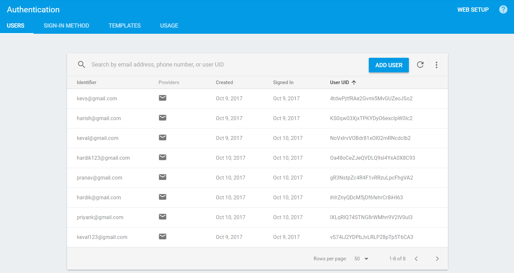

# Firebase Authentication
User registration and login using firebase services.


* User Registration/Sign Up-


* User Login-


* User Profile-


* Registered Users List on Firebase-



## Manual Testing of the App

The tests with the description and the results are in the following excel sheet-


## AWS Automated Test

The Application was tested using AWS Device Farm and the results were as follows-

* AWS Unit Test Devices List-


* AWS Unit Test Suites and Results-


Detailed Test Results for the Built-in Explorer Test Suite were as follows:

```
{"rootCause":"NO_FAILURE_DETECTED","isWifiConnected":true,"isLaunchScreenshotTaken":true,"isOpenGLApp":false,"unsuccessfulWatcherCount":0,"unvisitedComponentCount":0,"visitedComponentCount":1,"imageCount":0,"deviceFingerprint":"samsung\/matissewifiopenbnn\/matissewifiopenbnn:4.4.2\/KOT49H\/T530NUOVU1AOA2:user\/release-keys","ignoredComponentCount":0,"isLaunchSuccessful":true,"visitedScreenCount":1,"isExitDetected":false,"isCrashDetected":false,"totalTimeInMillis":31841,"isExitAfterSystemPopup":false,"visitedActivities":"[.MainActivity]","visitedActivityCount":1,"observation":"PASSED_BY_AVS","eventCount":2,"successfulWatcherCount":0,"securityThreat":"NO_ISSUE","sessionCount":1,"pid":11715,"securityStatus":{"totalOpenedSockets":0,"totalConnection":0,"totalOpenedPorts":0,"socketStats":[]},"isWebViewApp":false,"isExitAfterApplicationPopup":false,"isDropboxLogCollected":false,"isNonNativeViewApp":false,"isEntitlementPopup":false}
```

Hence, there were no failures detected and the application is free of bugs.
