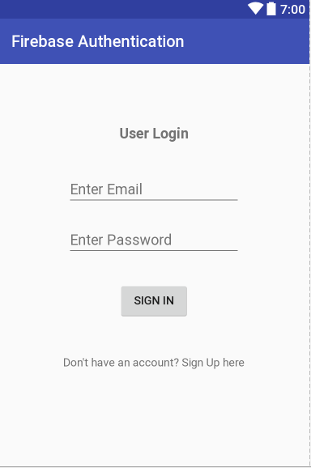
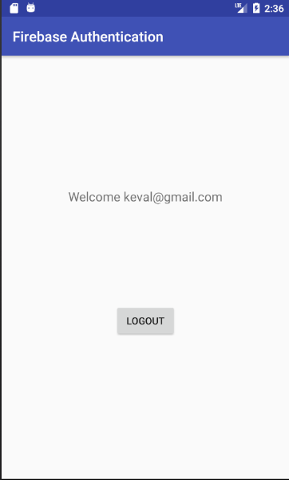

# Firebase Authentication
User registration and login using firebase services.

* User Registration/Sign Up-

* User Login-

* User Profile-

* Registered Users List on Firebase-

## Manual Testing of the App

The tests with the description and the results are in the following excel sheet-

## AWS Automated Test

